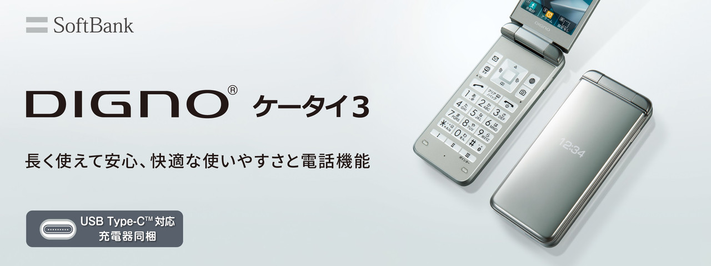

# Kyocera Digno 3 902KC/903KC.

The Kyocera Digno 3 Ketai 902KC/903KC model, referred to collectively as the 90X, is a 2020 flip phone manufactured by Kyocera, a Japanese electronics company. The 90X is praised by digital minimalists as a capable android feature phone, and one of the few that works with western carriers (almost) out of the box.

## Software Support
The 90XKC runs Android 8.1, and is lower-spec. Some modern apps and google services
won't work, but this is considered a good thing if you're purchasing for privacy or digital minimalism.

Luckily, the 90XKC has APK Support. You'll need to manually find and install APKs and install them using ADB. It's recommended you visit our [APKs](/en/introduction/apks/) page.

Most modern and unoptimized apps will work very slowly due to the low-spec, and the small-screen and lack of arrow navigation on some apps will force you to use the pointer in an awkward way.

## Specifications
At a glance, 90XKC features USB-C charging, Android 8.1 and Wifi 2.4GHz and Bluetooth 4.2.


|   | Kyocera Digno 3 Keitai 902KC/903KC | 
|---|---|
| CPU:  | Qualcomm Snapdragon 210 (MSM8909) Quad-core 1.1GHz  |   |   
| RAM: | 1GB  |       
| GPU | 8GB  |   |    
| ROM Storage: | 8GB  |   |      
| Wifi & Bluetooth: | Wifi 02.11 b/g/n (2.4GHz) w/ tethering, Bluetooth 4.2   |  
| Battery Capacity: | 1,700mAh KYBAQ1 |  |      
| Camera | 8MP CMOS  |  |      
| SD Card: | Up to 32GB  |   |   
| Display | Approximately 3.4 inch full wide VGA LCD|   |     
| Sub-Display* | Approximately 0.9 inch organic EL |   |     
| Dustproof  | IP5X |  
| Waterproof  | IPX5/IPX8 | 
| Shockproof  | Compliant with MIL standards |   
| Colors | silver/pink/black|  
| Weight | ~131g  |  
| Size | 51 x 112 x 17.9 mm folded  | 
| Charge time |  Approximately 140 minutes|   
| Pedometer  | ✅ |
| FM Radio | ✅  |  
| Infrared | ✅  | 

[Source](https://www.kyocera.co.jp/prdct/telecom/consumer/lineup/digno-keitai3/)

\* Some models seemingly don't have a sub-display. Investigation pending.


## Connectivity

It is imperative that you purchased an UNLOCKED or SIM FREE phone if you won't be using the locked in provider. Otherwise, you'll have a headache trying to unlock the phone and might need to pay someone in Japan to do the process for you.

The 903KC model is a Y!Mobile with [these specs](https://www.ymobile.jp/lineup/band/pdf/903kc_band.pdf ) [[mirror](https://web.archive.org/web/20230821070446/https://www.ymobile.jp/lineup/band/pdf/903kc_band.pdf)], while the 902KC is a Softbank model with [these specs](https://www.softbank.jp/biz/set/data/mobile/lineup/keitai/digno_keitai3_for_biz/specs/pdf/digno_keitai3_for_biz.pdf) [[mirror](https://web.archive.org/web/20230726131218/https://www.softbank.jp/biz/set/data/mobile/lineup/keitai/digno_keitai3_for_biz/specs/pdf/digno_keitai3_for_biz.pdf)]. The specifications are what radio frequencies ranges ("bands") the phone can connect to. 

Generally, the 90XKC is compatible with western carriers using 4G & LTE. Configuration and double checking is necessary, it's highly recommended that you view our [connectivity guide](/content/en/connectivity/) to learn about APNs and confirming support. 

### Carrier Support
This is community reported, and there have been outliers, so take this with a grain of salt and do your own research with our connectivity guide.

Carrier | Models | Compatibility | Notes
|--|--|--|--|
|T-Mobile/Mint | 902KC & 903KC | Almost Perfect | May need APN. GPS and Picture texting may not work.|
|AT&T | 902KC & 903KC | Limited Support | Needs APN, data only|
|Verizon | 902KC & 903KC | Unknown | Unknown.|

### APN Settings

You can change your APN by going to this settings menu:
 `Settings --> Wireless/Network --> Cellular Network --> Access Point Names`
## Tips
Press and hold the side key for manner mode (silent mode).

## Links & Manual
[English User Manual](https://faq.api.softbank.jp/olm_images/sb/136/PDF/digno-keitai3_en_userguide.pdf) [[Mirror](https://web.archive.org/web/20231021195947/https://faq.api.softbank.jp/olm_images/sb/136/PDF/digno-keitai3_en_userguide.pdf)]

## Reviews

- [Kyocera Digno 3 902kc/903kc Full Review](https://www.reddit.com/r/dumbphones/comments/16j4xb1/kyocera_digno_3_902kc903kc_full_review/) by Redditor [MCDiamond9](https://www.reddit.com/user/MCDiamond9/). [[Mirror](https://web.archive.org/web/20230923072229/https://www.reddit.com/r/dumbphones/comments/16j4xb1/kyocera_digno_3_902kc903kc_full_review/?rdt=42912)]

- [Kyocera Digno 3 902KC Review: Premium Design and Long Battery Life](https://www.youtube.com/watch?v=3VOKXcLY5B4) by Youtuber [JoseBriones](https://www.youtube.com/@JoseBriones)

- [Kyoceria Digno 3 902kc Overview](https://www.youtube.com/watch?v=2rPxN2ubVYs) by Youtuber [Mobile Phones & Tech](https://www.youtube.com/watch?v=2rPxN2ubVYs)
- [I don't like my Digno (Kyocera 902kc)](https://www.reddit.com/r/dumbphones/comments/14x0epk/i_dont_like_my_digno_kyocera_902kc/) by Redditor [mlgQU4N7UM](https://www.reddit.com/user/mlgQU4N7UM/). [[Mirror](https://web.archive.org/web/20230711191109/https://www.reddit.com/r/dumbphones/comments/14x0epk/i_dont_like_my_digno_kyocera_902kc/)]
